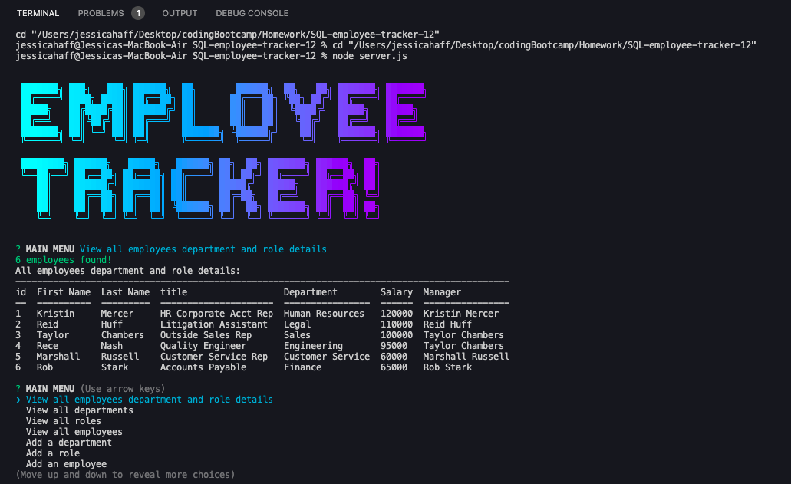

# Employee Tracker
<br>


## Description
A solution for managing a company's employees using node, inquirer, and MySQL.

<br>

## Table of Contents
* [Preview](#Preview)
* [Demonstration](#Demonstration)
* [Installation](#Installation)
* [Usage](#Usage)
* [Contributing](#Contributing)
* [Tests](#Test)
* [Questions](#Questions)    
* [License](#License)

<br>

## Preview
<br>



## Demonstration 
<br>
The below video demonstrates how to use this application:
<BR>

[VIDEO DEMONSTRATION](https://www.awesomescreenshot.com/video/7102849?key=9c6f7768ada24da24a0501dda8f703ea)

<br>

## Installation
Run the following command to install all necessary dependencies:
```
npm install
```

## Usage
```
1. Use the CLI interface to select employee management options. 
2. Menu options lead to additional prompts. 
3. Select the next option as needed. 
4. Use the exit option to close the application. 
```

## Contributing
No contributions are needed at this time.

## Tests
Run the following command to run tests:
```
node server.js
```

## Questions
If you have any questions about the repo, please contact me at jessicahaff5@gmail.com. If you would like to see more of my work, please go to my GitHub Profile [github.com/jesshaff](https://github.com/jesshaff).

## License
This project is licensed under the MIT license.

https://opensource.org/licenses/MIT
